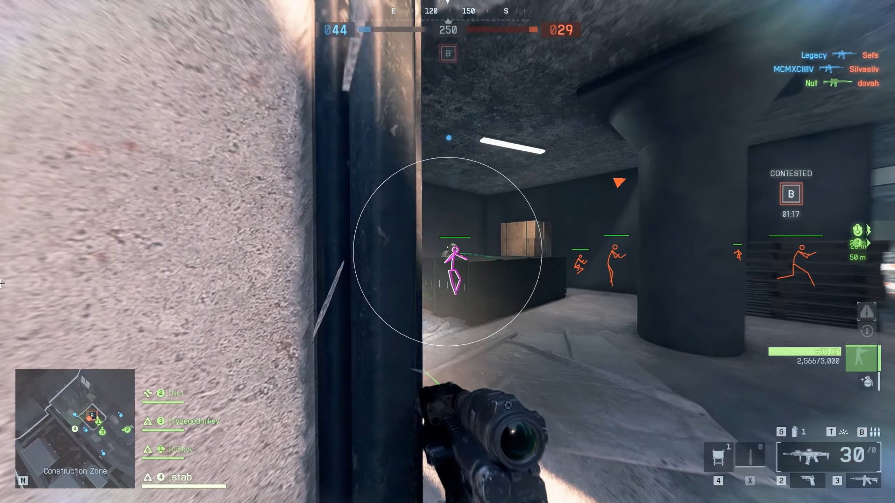
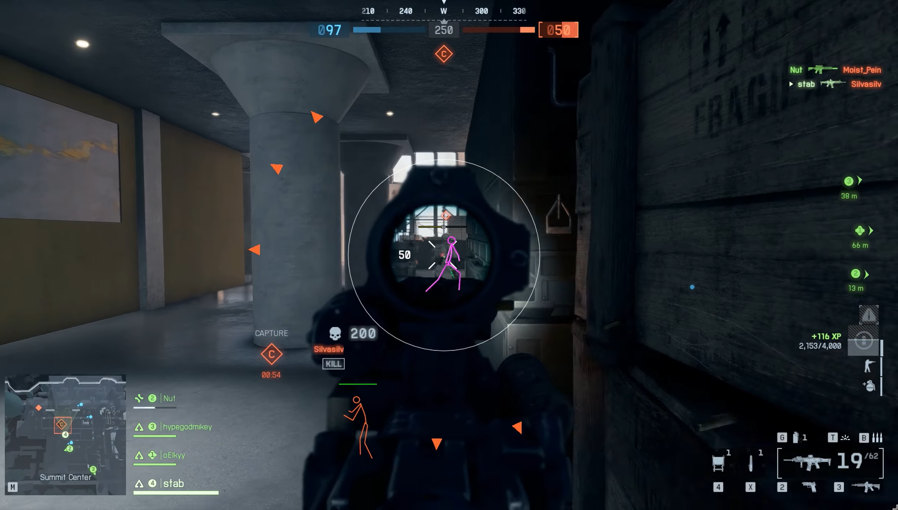
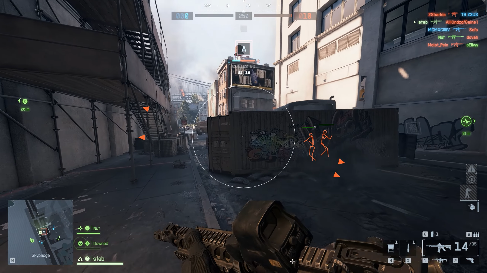
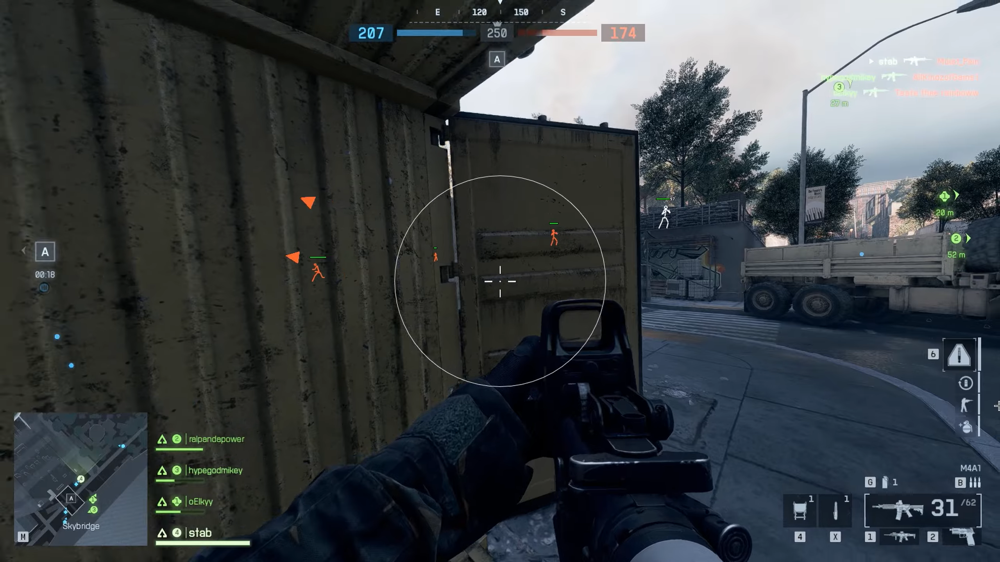

# Private Battlefield 6 Utility (Aimbot, ESP, Series Integration)

---

### ✅ Key Highlights

* **Multi‑Title Integration** — one license covers Battlefield 6, Battlefield 2042, Battlefield V, and Battlefield 1.
* **Effortless Setup** — streamlined configuration and adaptive settings.
* **Continuous Updates** — active development ensures full compatibility with new game builds.
* **Optimized Performance** — minimal CPU/GPU impact, built‑in resource management.

---

### 🔧 Core Features

* **Silent Aimbot** — smooth, invisible aim correction without visible snapping.
* **Bone Targeting** — choose specific body parts for precise targeting logic.
* **Nearest Target Priority** — system locks on to the closest opponent automatically.
* **Skeleton ESP** — visualize enemy bone structures in real time.
* **Nickname ESP** — see player tags directly in‑game.
* **Health ESP** — display opponent health metrics for tactical advantage.
* **Vehicle ESP & Weapon ESP** *(in development)* — upcoming modules for full 3D visualization of vehicles and equipment.
* **Recoil Control System** — stabilizes weapon recoil dynamically for higher accuracy.

> Some experimental features may be temporarily disabled in certain Battlefield builds pending stability updates.

---

### 🖥 System Requirements

| Component | Supported                                        |
| --------- | ------------------------------------------------ |
| **CPU**   | Intel / AMD multi‑core                           |
| **OS**    | Windows 10 / 11 (builds 1809–24H2)               |
| **BIOS**  | UEFI mode with GPT disk partitioning recommended |

---

### 🚀 Installation 🚀

1. ✅ **Download the latest release** from the [Releases](../../releases).
2. 📁 **Extract Files**: Unzip the archive to a secure folder.
3. 🟢 **Run Loader**: Launch `launcher.exe`

---

---

### ⚠️ Disclaimer

Use of gameplay modification tools in online environments may lead to penalties or account bans. All usage is solely at the user's own risk and discretion. The authors bear no responsibility for consequences arising from misuse.

---

### 🔎 SEO Optimization Layer

This document is fully optimized for search indexing and metadata recognition. Targeted long‑tail and semantic keywords include:

**battlefield 6 cheat**, **battlefield 6 aimbot**, **bf6 wallhack**, **battlefield 6 esp**, **private battlefield 6 software**, **battlefield 6 hack tools**, **battlefield cheat suite**, **bf6 recoil control**, **aim assist battlefield 6**, **battlefield 6 gameplay enhancer**, **battlefield 6 overlay**, **battlefield utility 2025**, **battlefield 6 multi‑title tool**, **fecurity battlefield 6**.

---

### 📃 Legal Notice

All materials in this repository are provided **for educational and analytical purposes only**. This content does **not promote cheating or unfair gameplay**. Developers and contributors assume **no liability** for misuse or redistribution. All mentioned game titles and assets are trademarks of their respective owners.

---

### 💬 Final Note

**Fecurity — Tactical insight, adaptive precision, private evolution.**
Use responsibly. Play intelligently. Learn from data — not from shortcuts.
